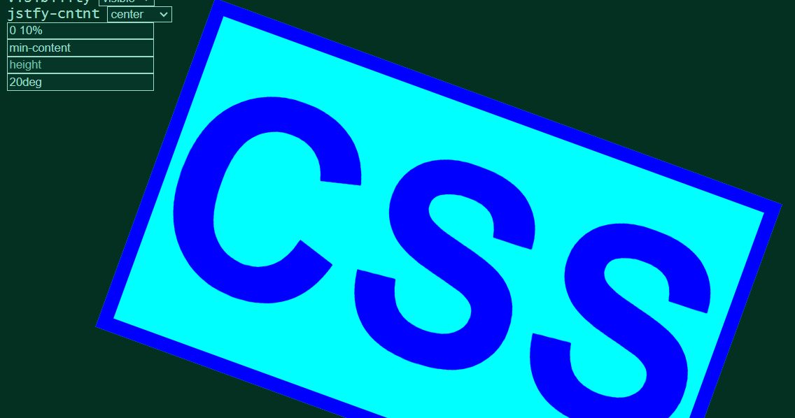

# CSS TESTER

This Javascript tool allows you to add CSS effects to any common HTML5 element.

[Use on Homepage](https://greybeard42.github.io/javascript/cssTest/)

# ELEMENTS:

- h1-h6

- p

- a

- b

- i

- input

- textarea

- button

- image

- div

# CSS PROPERTIES:

- font-family

- font-size

- text-align

- color

- background

- border

- cursor

- user-select

- display

- visibility

- justify-content

- margin

- width

- height

- rotate

- scrollbar-color

# OTHER PROPERTIES:

- innerText

- placeholder

- href

[CSS Tester](http://greybeard42.neocities.org/javascript/cssTest/) © 2024 by [GreyBeard42](../../../) is licensed under [CC BY-NC-SA 4.0](https://creativecommons.org/licenses/by-nc-sa/4.0/?ref=chooser-v1)

   
